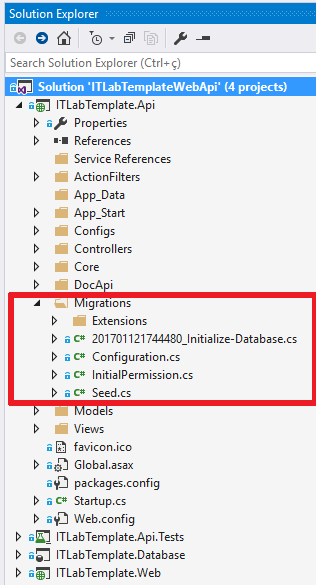

# Controle de versão do banco de dados
É possível realizar o controle de versão do banco de dados de duas formas:
1. Através do [**Entity Framework Migrations**](https://imasters.com.br/framework/dotnet/como-usar-entity-framework-migrations/?trace=1519021197&source=single).
2. Através do [**Project DataBase**](https://msdn.microsoft.com/en-us/library/xee70aty(v=vs.100).aspx).

## Controlar a versão do banco de dados com o Entity Framework Migrations
Basicamente, ao utilizar o Entity Framework Migrations para controlar a versão do banco de dados, os scripts para criar, alterar e excluir objetos e dados do banco de dados são gerados e versionados pelo Entity Framework à partir do código C#.

Com o **Migrations** cada mudança de banco de dados pode ser versionada de uma forma mais fácil, permitindo realizar a implementação ou rollback das mudanças de banco de dados de uma forma mais controlada e fácil.

### Como realizar o setup do banco de dados
O template está configurado por padrão para não realizar nenhuma ação contra o banco de dados ao inicializar o sistema (veja mais sobre as estratégias de inicialização do banco de dados [clicando aqui](http://www.entityframeworktutorial.net/code-first/database-initialization-strategy-in-code-first.aspx)), isso significa que, quando quiser atualizar o banco de dados você deverá executar os comandos do Entity Framework Migrations manualmente através do **Package Manager Console**.

No projeto **\<nome-projeto\>.Api** temos uma pasta chamada **Migrations**, é nesta pasta que ficam os arquivos utilizados pelo Entity Framework Migrations, nela temos os seguintes arquivos:

  

- Arquivo **Configuration.cs**: Arquivo responsável pela configuração do Migrations, a única coisa que você precisa definir neste arquivo é em qual ambiente o Migrations será executando, podendo ser:
  - **Desenvolvimento Local**: Defina este ambiente caso você rode o Migrations contra uma base de dados local, no seu computador. Neste caso o Migrations **IRÁ CRIAR** uma role no seu banco de dados, é nesta role que serão dadas as permissões.
  - **Homologação IT Lab**: Defina este ambiente caso você rode o Migrations contra uma base de dados que estiver no servidor de desenvolvimento/homologação da IT Lab. Neste caso o Migrations **NÃO IRÁ CRIAR** uma role no banco de dados do servidor pois ela provavelmente já deverá existir (criada quando o banco de dados foi criado).
  
  **IMPORTANTE:** Recomenda-se que as permissões aos objetos do banco de dados sejam dadas à roles e não diretamente aos objetos.

Defina o ambiente na linha de código abaixo:
```csharp
//Defina o ambiente para o qual se executará o migrations
Environment.EnvironmentTpe = Environment.Type.DesenvolvimentoLocal;
```
   
Independente do ambiente em que estiver executando (**Desenvolvimento Local** ou **Homologação IT Lab**) você deve definir o nome da role na qual as permissões aos objetos SQL serão dadas.

Defina o nome da role na linha de código abaixo:
```csharp
//Defina o nome da role
DataBaseConfig.DataBaseRoleName = "grp_App_ITLabTemplateWebAPI";
```
  **IMPORTANTE:** No caso do ambiente **Homologação IT Lab**, antes verifique o nome da role criada no banco de dados.

- Arquivos **InitialPermission.cs** e **XXXXX_InitialPermission.cs**: Estes arquivos possuem código C# para instruir o Migrations a conceder as permissões necessárias aos objetos SQL iniciais do template à role configurada no arquivo **Configuration.cs**.

- Arquivo **Seed.cs**: Este arquivo possui código C# responsável por alimentar dados nas tabelas quando o Migrations for executado contra o banco de dados. Tratam-se de dados básicos para o funcionamento do sistema e dados para teste.

- Arquivo **XXXXX_Initialize-Database.cs**: Este arquivo possui código C# para instruir o Migrations a criar os objetos SQL iniciais do template no banco de dados. Este arquivo foi gerado automaticamente pelo Migrations à partir das Entitidades mapeadas no Entity Framework.

Para criar um novo banco de dados utilizando o Migrations, siga os passos abaixo:
1. Configure a string de conexão com o banco de dados no arquivo **Web.Config** que está no projeto **\*.Api**. Ao abrir o **Web.Config** você verá duas strings de conexão com o devido comentário:

```csharp
  <connectionStrings>
    <!-- Connection String utilizando autenticação com usuário/senha do SQL -->
    <add name="DefaultConnection" connectionString="Data Source=.\SQLExpress;Initial Catalog=ITLabTemplateWebAPI; User ID=sa;Password=sa; Integrated Security=False; MultipleActiveResultSets=true" providerName="System.Data.SqlClient"/>
    <!-- Connection String utilizando autenticação integrada (usuário logado na máquina do back-end) -->
    <!--<add name="DefaultConnection" connectionString="Data Source=.\SQLExpress;Initial Catalog=ITLabTemplateWebAPI; Integrated Security=True; MultipleActiveResultSets=true" providerName="System.Data.SqlClient" />-->
  </connectionStrings>
```
  - Uma que utiliza um usuário/senha do SQL Server para se conectar no SQL.
  - Outra que utiliza o usuário autenticado no Windows para se conectar no SQL.

    Utilize a string de conexão que desejar, deixando apenas uma delas "ativa".

    **IMPORTANTE:** 
    - Na maioria dos cenários (clientes) a conexão com o SQL Server será através de um usuário/senha do SQL exclusivo para sua aplicação, por este motivo, ao realizar testes na aplicação utilize o usuário/senha do SQL.
    - Quando estiver desenvolvendo, para criar, alterar e excluir objetos SQL do banco de dados, utilize suas credenciais do windows pois é muito provável que o usuário/senha do SQL criado para a aplicação não tenha as permissões necessárias para realizar alteração na estrutura do banco de dados.

    Para este passo-a-passo, como vamos alterar a estrutura do banco de dados (criar tabelas), vamos utilizar a string de conexão que utiliza o usuário autenticado no Windows para se conectar no SQL, nesta string de conexão defina o nome do servidor/instância SQL (Data Source) e o nome do banco de dados (Initial Catalog). Caso você possua um usuário/senha do SQL com permissões para alterar a estrutura do banco de dados, pode-se utilizar a outra string de conexão.

2. Abra o **Package Manager Console** (Tools > NuGet Package Manager > Package Manager Console).
3. No **Package Manager Console**:
  
    3.1. Selecione o **Default Project** o projeto **<nome-projeto>.Api**.
  
    3.2. Digite o comando:
```bash
update-database -StartUpProjectName <nome-projeto>.Api -verbose
```
    O comando acima executará contra o banco de dados os scripts SQL gerados pelo **Migrations** do projeto **\*.Api**, exibindo no console o andamento e scripts que estão sendo executandos (-verbose). Caso o banco de dados não exista, o **Migrations** irá criá-lo automaticamente.
  
  Como mencionado anteriormente, os scripts SQL serão gerados automaticamente pelo **Migrations** à partir do código C#, neste primeiro momento ele executará apenas os dois **Migrations** que já vem com o template, na ordem abaixo:
  - Arquivo **XXXXX_Initialize-Database.cs**: Cria os objetos SQL iniciais.
  - Arquivo **XXXXX_InitialPermission.cs**: Concede permissão aos objetos SQL criados.
  - Arquivo **Seed.cs**: Alimenta as tabelas com dados iniciais.
  
  **IMPORTANTE**: Os **Migrations** são executados na ordem em que foram criados, pode-se ver isso através da data e hora, em que foram criados, que é o prefixo do nome dos arquivos mencionados acima, por último é executado o arquivo **Seed.cs**.

### Restaurar o banco de dados ao estado inicial
Para restaurar o banco de dados ao estado inicial, ou seja, da forma como ele estava antes de aplicar os scripts do **Migrations**, execute o comando abaixo no **Package Manager Console**:
```bash
update-database -StartUpProjectName <nome-projeto>.Api -TargetMigration:0 -verbose
```

### Como criar e versionar uma mudança no banco de dados
Ao utilizar o **Migrations** para controlar a versão do banco de dados, qualquer mudança na estrutura de tabelas do banco de dados **NÃO DEVE** ser realizada diretamente no SQL Server, a mudança deve ser feita no código C# (Entidades e Mapeamento) e o **Migrations** entenderá a mudança e criará o script SQL para alterar a estrutura das tabelas.

Exemplo: Imagine que você precise criar um campo inteiro (Int) em uma entidade existente, primeiramente você cria o campo na classe que define a entidade:
```csharp
public int Codigo { get; set; }
```
Feita a mudança no código C#, inclusive pode ser mais de uma mudança, em seguida você deve criar o **Migrations** que representará esta mudança, para isso, abra o **Package Manager Console** e execute o comando:
```bash
add-migration "Novo-campo"
```
Ao executar o comando acima o **Migrations** entenderá todas as mudanças realizadas nas entidades, à partir do último **Migration** criado, e criará um novo **Migration** com o código C# que representará as mudanças, ou seja, na pasta **Migrations** que está na raiz do projeto **\*.Api**, será criado um novo arquivo denomiado **XXXXX_Novo-Campo.cs**, onde **XXXXX** será a data e hora em que o arquivo foi gerado.

**IMPORTANTE**: Você pode criar vários **Migrations**, cada **Migration** pode representar uma mudança específica ou várias mudanças.

Após criado o **Migrations** que representa a mudança, basta executá-lo contra o banco de dados, imaginando que o banco de dados já foi criado com os objetos iniciais (passos explicados anteriormente), basta executar o comando abaixo no **Package Manager Console**:
```bash
update-database -StartUpProjectName <nome-projeto>.Api -TargetMigration:Novo-campo -verbose
```

O comando ``update-database`` tem como objetivo atualizar o banco de dados conforme os parâmentros passados para ele, no caso do comando acima, ele atualizará o banco de dados para refletir TODAS as mudanças de estrutura de dados até chegar na mudança alvo, que neste caso é a **Novo-Campo**. Para fazer isso, primeiramente o **Migrations** avalia o banco de dados para saber quais mudanças já estão aplicadas no banco de dados, depois disso ele executará SOMENTE os **Mirgrations** até chegar no indicado no parâmetro ``-TargetMigration:``.


Exemplo: Imagine o cenário onde você tenha os três **Migrations** no projeto e nenhum objeto no banco de dados:
  1. **XXXXX_Initialize-Database.cs**.
  2. **XXXXX_InitialPermission.cs**.
  3. **XXXXX_Novo-Campo.cs**.
 
Ao executar o comando abaixo, todos os **Migrations** acima serão executados, na ordem em que foram criados, até chegar no **Migration** alvo que é ``Novo-Campo``.
```bash
update-database -StartUpProjectName <nome-projeto>.Api -TargetMigration:Novo-campo -verbose
```

No mesmo cenário acima, caso seja executado o comando abaixo, serão executados somente os **Migrations** criados até o alvo indicado que é  ``InitialPermission``, ou seja, somente os migrations ``Initialize-Database`` e ``InitialPermission`` serão executados.
```bash
update-database -StartUpProjectName <nome-projeto>.Api -TargetMigration:InitialPermission -verbose
```

## Controlar a versão do banco de dados com o Project DataBase (TEXTO AINDA EM CONSTRUÇÃO)
Ao utilizar o Project DataBase, os scripts para criar, alterar e excluir objetos e dados do banco de dados são versionados em arquivos de scripts SQL no projeto **\<nome-projeto\>.Database**.
