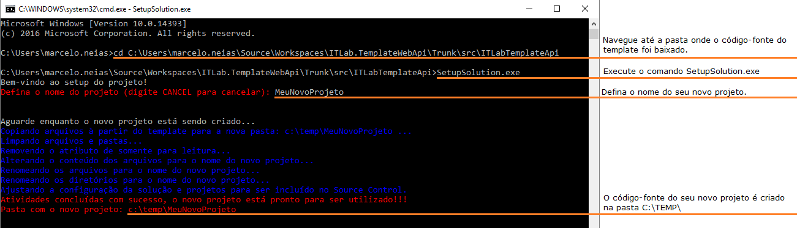
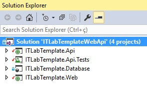
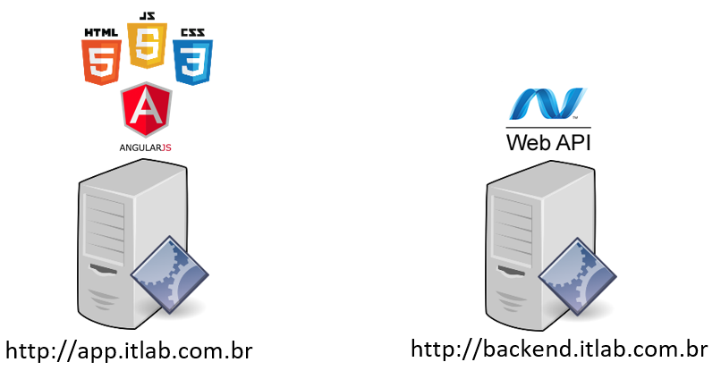
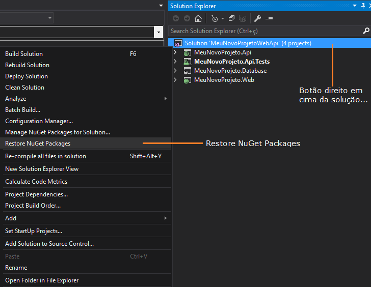

# Setup de uma nova solução baseada no Template Web ASP NET IT Lab
## Criando o sua nova solução:
1. Através do Source Control do Visual Studio, navegue até a pasta **$/ITLab.TemplateWebApi/Trunk/src/**.

2. Dê um *Get Lastet Version* na pasta **ITLabTemplateAPI**
    <br>Com isso o Visual Studio irá baixar uma cópia do template na pasta mapeada em sua máquina.
    
    **IMPORTANTE:**
     - A pasta a ser mapeada no Visual Studio para baixar o código-fonte do template não pode ser **C:\TEMP**, caso seja esta pasta você terá problemas nos passos seguintes.
     - Não utilize este código-fonte recém baixado na sua máquina para desenvolver o novo projeto, você deverá seguir os passos abaixo que ajudará a criar uma cópia deste código-fonte já preparado para o seu novo projeto.

3. Abra um **Prompt de Comando** do Windows e navegue até a pasta onde o código-fonte do template foi baixado do TFS.

4. Execute o comando **SetupSolution.exe**.
    <br>Ao executar este comando iniciará um pequeno wizard para te auxiliar na criação, a 1ª pergunta será o nome da sua nova solução, defina uma nome EVITANDO espaços e caracteres especiais.
    Recomenda-se que o nome da solução seja no formato: **\<nome-cliente\>.\<nome-solução\>**, como por exemplo: **Bayer.SRC**, onde Bayer é o nome do cliente e SRC é o nome de referência ao projeto.
    <br>Ao término da execução deste wizard, uma cópia do código-fonte do template será criada na pasta **C:\TEMP** em uma subpasta com o nome que você definiu no wizard.


Se preferir, agora você já pode incluir/mover este código-fonte gerado (da pasta **C:\TEMP**) para a pasta\repositório do seu novo projeto no TFS.

## Entenda a solução criada
Antes de continuarmos, vamos entender como a solução está estruturada, na pasta criada com o código-fonte da sua nova solução, temos a solução (.sln) com os seguintes projetos:
<br>
<br>
1. **\<nome-projeto>.Api**: Este projeto contém o código .NET (C#) das APIs (Back-End), é neste projeto que se implementa as regras de negócio e persistência no banco de dados.

2. **\<nome-projeto>.Web**: Este projeto contém o código HTML/CSS/JavaScript (Front-End), é neste projeto que se implementa as telas e componentes visuais do sistema.

3. **\<nome-projeto>.Api.Tests**: Este projeto contém o código .NET (C#) de testes do código do projeto ITLabTemplate.Api (Back-End).

4. **\<nome-projeto>.Database**: Este projeto contém os scripts [T-SQL](https://pt.wikipedia.org/wiki/Transact-SQL) do projeto, tais como para criação das tabelas no SQL Server.
Através deste projeto você pode manter o controle de versão para todos os seus objetos do SQL Server, tais como: Tabelas, Stored Procedures e Views.
<br>Também é recomendado que você mantenha neste projeto os scripts [T-SQL](https://pt.wikipedia.org/wiki/Transact-SQL) de alteração de banco de dados para cada nova versão, isso facilitará o deploy para cada versão da aplicação.


## Possíveis cenários para execução do sistema
Da forma como a solução está estruturada, temos dois possíveis cenários para executar o sistema:

**Cenário A**: Back-End [(API)](https://pt.wikipedia.org/wiki/Interface_de_programa%C3%A7%C3%A3o_de_aplica%C3%A7%C3%B5es) e Front-End hospedado no mesmo endpoint (mesmo servidor/endereço de aplicação), exemplo:

- Back-End e Front-End respondendo no mesmo endereço: http://app.itlab.com.br
<br>

**Cenário B**: Back-End [(API)](https://pt.wikipedia.org/wiki/Interface_de_programa%C3%A7%C3%A3o_de_aplica%C3%A7%C3%B5es) hospedado em um endpoint diferente do Front-End (servidores/endereços de aplicação diferentes), sendo que o usuário sempre acessará a aplicação pelo endereço do Front-End, exemplo:

- Back-End respondendo no endereço: http://backend.itlab.com.br
- Front-End respondendo no endereço: http://app.itlab.com.br
<br>

**IMPORTANTE:**
- Por padrão o template está configurado no Cenário B, ou seja, traz o **Front-End** e **Back-End** em dois end-points diferentes, sendo:
    - **Front-End**: End-point http://localhost:8080
    - **Back-End**: End-Point http://localhost:8081 
- Por questões de segurança, no **AMBIENTE DE PRODUÇÃO**, é recomendado que o Back-End e Front-End respondam apenas pelo **https** e não pelo **http**.

## Pacotes do NuGet
Antes de mais nada, restaure os pacotes que o template utiliza através do NuGet, para isso, basta abrir a solução (.sln) no Visual Studio, clicar com o botão direito do mouse na solução e acionar o comando **Restore NuGet Packages** (se você der um **Build Solution** o Visual Studio também irá restaurar os pacotes).



**ATENÇÃO:** É recomendado que após restaurar os pacotes, feche-se a Solução/Visual Studio e abra novamente! (Thank you Microsoft!)

## Modos: Protótipo x Desenvolvimento
O template possui dois modos: **Protótipo (Prototype)** e **Desenvolvimento**:
1. No modo Protótipo o **Front-End** fica desacoplado do **Back-End**, com isso temos maior agilidade na criação do protótipo onde todas as operações de persistência (inserir/alterar/excluir) são simuladas em memória, sem acionar as APIs do **Back-End** (e consequentemente sem acionar banco de dados), devemos usar este modo para construir o protótipo das telas.
2. No modo Desenvolvimento o **Front-End** está acoplado ao **Back-End** (e consequentemente ao banco de dados), devemos usar este modo após termos o protótipo aprovado.

O que determina se estamos executando no modo **Protótipo** ou **Desenvolvimento** é qual arquivo javascript **DE SERVIÇO** que estamos utilizando. Os arquivos javascript de serviço são aqueles cujo nome possui a palavra `service`.

Quando estiver referenciado o arquivo javascript com o sufixo `service.prototype.js`, significa que está sendo executado no modo **Protótipo**, já, quando estiver referenciado o arquivo javascript sem o sufixo `.prototype.js` (apenas `.service.js`), significa que está sendo executado no modo **Desenvolvimento**. Exemplo: 
- O arquivo `service.prototype.js` indica que é um arquivo utilizado apenas em **tempo de protótipo** (simula a persistência em memória, não aciona o Back-End).
- O arquivo `service.js` indica que é um arquivo utilizado em **tempo de desenvolvimento** (aciona as APIs do Back-End).

É possível que algumas funcionalidades sejam executadas em modo **Protótipo** e outras em modo **Desenvolvimento**, por exemplo, é possível que a funcionalidade Gerenciamento de Clientes esteja sendo executada em modo **Protótipo** ao mesmo tempo que a funcionalidade de Gerenciamento de Paises esteja sendo executada em modo de **Desenvolvimento**.

**IMPORTANTE:** Obviamente que, ao realizar a entrega final do sistema para o cliente, todas as funcionalidades devem estar sendo executadas em modo **Desenvolvimento**. :)

Por padrão a solução vem configurada para o modo **Protótipo**, veja abaixo como configurar a solução para executar entre um modo e outro (alterações a serem realizadas no projeto **Front-End**)
### Modo Protótipo (prototype)

1. Arquivo `/index.html`, os arquivos abaixo devem referenciar aqueles com sufixo `.service.prototype.js`:

```html
<script src="app/core/services/authentication.service.prototype.js"></script> <!-- Serviço/Funções responsável pela autenticação do usuário e informações sobre sua autenticação -->
<script src="app/core/services/commons.service.prototype.js"></script> <!-- Serviços/Funções comuns a maioria das funcionalidades do sistema -->
<script src="app/core/pages/notifications/list.service.prototype.js"></script> <!-- Serviço que prove as notificações ao usuário -->
```
2. Arquivo `/app/app.route.js`, neste arquivo você pode configurar o modo **Protótipo** x **Desenvolvimento** por funcionalidade, referenciando o arquivo com sufixo (`.service.prototype.js`) ou sem o sufixo (`.service.js`), por exemplo: no trecho abaixo, responsável pela tela de edição de usuários, estamos utilizando no modo **Protótipo**: 
```javascript 
files: [
    'app/core/pages/dataVisibility/crud.service.prototype.js',  //COM o sufixo .service.prototype.js
    'app/core/pages/security/user/service.prototype.js',        //COM o sufixo .service.prototype.js
    'app/core/pages/security/user/edit.controller.js',
]
```
Já no trecho abaixo, responsável pelo cadastro de novos usuários, estamos utilizando no modo **Desenvolvimento**:
```javascript
files: [
    'app/core/pages/dataVisibility/crud.service.js',    //SEM o sufixo .service.prototype.js
    'app/core/pages/generalSettings/edit.service.js',   //SEM o sufixo .service.prototype.js
    'app/core/pages/security/user/service.js',          //SEM o sufixo .service.prototype.js
    'app/core/pages/security/user/new.controller.js',
]
```

**IMPORTANTE:** Caso o serviço de autenticação referenciado seja o modo **Protótipo**, todas as demais funcionalidades também devem utilizar os serviços no modo **Protótipo**, caso contrário você terá erro de não autenticado/sem permissão ao acionar as APIs do Back-End.
```html
<script src="app/core/services/authentication.service.prototype.js"></script> <!-- Serviço/Funções responsável pela autenticação do usuário e informações sobre sua autenticação -->
```

Como mencionado anteriormente, por padrão a solução vem configurada para o modo **Protótipo**, desta forma você já conseguirá construir o protótipo do novo sistema utilizando HTML/CSS/Javascript (Telas / **Front-End**), sem a necessidade de ter um **Back-End** (APIs e acesso a banco de dados), para isso basta iniciar apenas o projeto **\*.Web** (botão direito do mouse em cima do nome do projeto > Set as StartUp Project), neste momento não é necessário iniciar o projeto **\*.Api**.

Com a aprovação do protótipo e início do desenvolvimento do sistema como um todo, será necessário programar também o **Back-End** (APIs e acesso a banco de dados), quando chegar neste momento você precisará iniciar os dois projetos e principalmente realizar o setup do banco de dados.
Para realizar o setup do banco de dados, primeiramente você deverá decidir sobre qual o mecanismo você utilizará para controlar a versão do banco de dados, [clique aqui](DataBase-Version-Control.md) e leia a documentação que explica os possíveis métodos de controle de versão (**Migrations** e **Project Database**) e como realizar o setup do banco de dados.