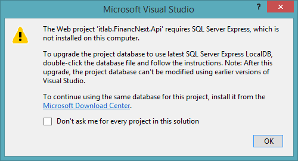
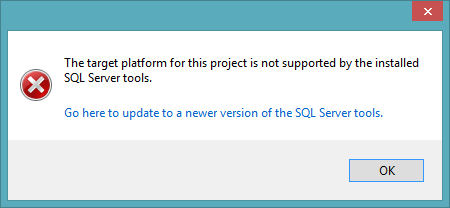

# Lista dos problemas conhecidos ao realizar o desenvolvimento com o Template Web ASP NET API
## Abertura da Solução/Projeto
<strong>1. Ao abrir a solução tenho a mensagem de erro abaixo: (SQL Server Express)</strong>
<br>

<strong>Causa:</strong> Falta do SQL Server Express 2016 na máquina do desenvolvedor.

<strong>Solução:</strong> Instale o SQL Server Express 2016 (ou superior) https://www.microsoft.com/en-us/download/details.aspx?id=54284

<br><br>
<strong>2. Ao abrir a solução, tenho a mensagem de erro abaixo: (SSDT)</strong>
<br>

<strong>Causa:</strong> Falta do SSDT (SQL Server Data Tools) na máquina do desenvolvedor.

<strong>Solução:</strong> Instale o SSDT na máquina do desenvolvedor. https://docs.microsoft.com/pt-br/sql/ssdt/download-sql-server-data-tools-ssdt

<br><br>
<strong>3. Após abrir a solução, um ou mais projetos ficam marcados com o erro <strong>(load failed)</strong> ao lado do nome da solução e com isso o projeto não abre.</strong>
<br><strong>Causa:</strong> Falta do SSDT (SQL Server Data Tools) e/ou SQL Server Express 2016.

<strong>Solução:</strong> Instale o SSDTe SQL Server Express 2016 na máquina do desenvolvedor.

## Browsers/Navegadores
<strong>4. Problemas ao executar o sistema no browser Safari no iPad/iPhone</strong>

<strong>Sintoma:</strong> Ao executar o sistema no browser Safari no iPad/iPhone o mesmo não é executado corretamente, podendo apresentar a mensagem abaixo no lugar das mensagens provindas do dicionário (ex: labels):
```html
{{translation()}}
``` 
<p>Além disso, ao debugar, a mensagem de erro abaixo é exibida no console do Developer Tools do navegador:</p>

```html
SyntaxError: Unexpected keyword 'const'. Const declarations are not supported in strict mode. 
```
<strong>Causa:</strong> Utilização da keyword <strong>'const'</strong> no Javascript em strict mode.

<strong>Solução:</strong> Não utilize a keyword <strong>'const'</strong>, utilize <strong>'var'</strong>.
<br><strong>IMPORTANTE:</strong> O Template Web da IT Lab à partir da versão 2.1 já não utiliza mais a keyword 'const' no Javascript, as versões anteriores do template podem apresentar este problema, neste caso basta aplicar a solução descrita acima.

<br><br>
<strong>5. Problemas ao executar o sistema no browser Internet Explorer 11 (IE 11) no modo protótipo</strong>

<strong>Sintoma:</strong> Ao executar o sistema no browser Internet Explorer 11 no modo protótipo a autenticação não ocorre, podendo deixar a tela congelada e apresentar a seguinte mensagem de erro no console do Developer Tools do browser:
<br>

```html
Expected identifier, string or number
authentication.service.prototype.js (147,13)
```
<strong>Causa:</strong> Utilização do colchetes "[ ]" para declarar propriedade, onde o nome tem caracteres especiais, em objeto no javascript.

<strong>Solução:</strong> Não utilize cochetes "[ ]" para declarar propriedade em objeto no javascript.
<br>Troque o trecho de código abaixo no arquivo <strong>*.Web/app/core/services/authentication.service.prototype.js</strong>
```javascript
        var itemPrototype = {
            access_token: 'token_fake',
            token_type: 'bearer',
            expires_in: 1799,
            userName: 'admin',
            ['as:client_id']: 'WebAngularAppAuth',
            ['.issued']: new Date(),
            ['.expires']: moment().add(30, 'minutes').toDate()
        };
```
Pelo trecho de código:
```javascript
        var itemPrototype = {
            access_token: 'token_fake',
            token_type: 'bearer',
            expires_in: 1799,
            userName: 'admin',
            'as:client_id': 'WebAngularAppAuth',
            '.issued': new Date(),
            '.expires': moment().add(30, 'minutes').toDate()
        };
```
<br><strong>IMPORTANTE:</strong> O Template Web da IT Lab à partir da versão 2.4 já traz esta correção, as versões anteriores do template podem apresentar este problema, neste caso basta aplicar a solução descrita acima.

<br><br>
<strong>6. Dados não são atualizados na tela após cadastrar ou alterar um registro utilizando o browser Internet Explorer 11 (IE 11).</strong>

<strong>Sintoma:</strong> Ao cadastrar ou alterar um registro, utilizando o browser Internet Explorer 11, os dados não são atualizados na tela, mesmo após acionar o F5 do browser.

<strong>Causa:</strong> O Internet Explorer 11, por padrão, realiza cache de requisições AJAX utilizando o método GET.

<strong>Solução:</strong> Instrua o browser a não realizar cache para requisições AJAX utilizando o método GET.
<br>No arquivo <strong>*.Web/app/core/services/apiInterceptor.service.js</strong> na função <strong>function request(config)</strong> logo acima da linha:
```javascript
config.headers['Accept'] = 'application/json';
```
Inclua o trecho de código abaixo:
```javascript
    if (config.method.toUpperCase() == 'GET') {
        config.headers['Cache-Control'] = 'no-cache';
        config.headers['Pragma'] = 'no-cache';
    }
```
<br><strong>IMPORTANTE:</strong> O Template Web da IT Lab à partir da versão 2.4 já traz esta correção, as versões anteriores do template podem apresentar este problema, neste caso basta aplicar a solução descrita acima.

## Problemas em geral
**7. Caracteres acentuados com problemas.**

**Sintoma:** Os caracteres acentuados não são exibidos ou são exibidos caracteres estranhos no lugar do acentuados.

**Causa:** Enconding dos arquivos.

**Solução:** Altere o Enconding dos arquivos (principalmente daqueles que possuem o texto, podendo ser inclusive um arquivo .js) para **UTF-8 BOM**.
Após alterar o Enconding do arquivo, abra-o novamente e ajuste o texto, re-escreva o texto com acentuação.

<br><strong>IMPORTANTE:</strong> Este problema não era do template em si mas do gerador do novo projeto à partir do template, projetos gerados antes do dia 09/Janeiro/2018 podem apresentar este problema (o gerador de projetos foi ajustado no dia 08/Janeiro/2018).
