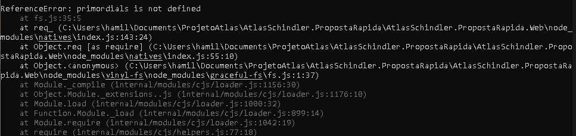
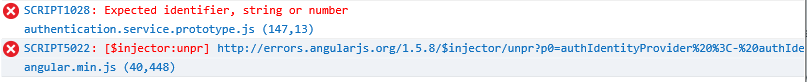

# Lista dos problemas conhecidos ao realizar o desenvolvimento com o Template Web ASP NET API
## 1. Abertura e Execução da Solução/Projeto
<strong>1.1 Ao abrir a solução tenho a mensagem de erro abaixo: (SQL Server Express)</strong>
<br>

<strong>Causa:</strong> Falta do SQL Server Express 2016 na máquina do desenvolvedor.

<strong>Solução:</strong> Instale o SQL Server Express 2016 (ou superior) https://www.microsoft.com/en-us/download/details.aspx?id=54284

<br><br>
<strong>1.2. Ao abrir a solução, tenho a mensagem de erro abaixo: (SSDT)</strong>
<br>

<strong>Causa:</strong> Falta do SSDT (SQL Server Data Tools) na máquina do desenvolvedor.

<strong>Solução:</strong> Instale o SSDT na máquina do desenvolvedor. https://docs.microsoft.com/pt-br/sql/ssdt/download-sql-server-data-tools-ssdt

<br><br>
<strong>1.3. Após abrir a solução, um ou mais projetos ficam marcados com o erro <strong>(load failed)</strong> ao lado do nome da solução e com isso o projeto não abre.</strong>
<br><strong>Causa:</strong> Falta do SSDT (SQL Server Data Tools) e/ou SQL Server Express 2016.

<strong>Solução:</strong> Instale o SSDTe SQL Server Express 2016 na máquina do desenvolvedor.

<br><br>
**1.4. Erro ao tentar executar o Front-End**

**Sintoma:** Ao tentar executar o Front-End através do **NodeJs + gulp**, a mensagem de erro abaixo é exibida no console e o Front-End não é executado.

```html
Error: listen EACCES 0.0.0.0:8080
```


**Causa:** Um outro site/sistema/serviço está sendo executado na mesma porta que o Front-End está configurado para ser executado (por padrão, porta 8080).

**Solução:**

A. Verifique se a solução no Visual Studio está executando, além do Back-End, também o Front-End, caso esteja, configure para o Visual Studio executar apenas o Back-End, uma vez que o Front-End é recomendável que se execute através do **NodeJs + gulp**.

B. Verifique se algum outro site ou serviço não está ocupando a mesma porta que o Front-End está configurado para ser executado (por padrão, porta 8080).

<br><br>
**1.5. Erro ao iniciar o Front-End**

**Sintomas:** Ao executar o gulp para subir o Front-end a seguinte mensagem aparece no console:


**Causa:** A versão do **Node** que está utilizando não é compativel com a versão do projeto

**Solução:** Instalar a versão ***v8.17.0*** do **Node**, e repetir os passos de **configuração do Front-End**

## 2. Browsers/Navegadores

<strong>2.1. Problemas ao executar o sistema no browser Safari no iPad/iPhone</strong>

<strong>Sintoma:</strong> Ao executar o sistema no browser Safari no iPad/iPhone o mesmo não é executado corretamente, podendo apresentar a mensagem abaixo no lugar das mensagens provindas do dicionário (ex: labels):
```html
{{translation()}}
``` 
<p>Além disso, ao debugar, a mensagem de erro abaixo é exibida no console do Developer Tools do navegador:</p>

```html
SyntaxError: Unexpected keyword 'const'. Const declarations are not supported in strict mode. 
```
<strong>Causa:</strong> Utilização da keyword <strong>'const'</strong> no Javascript em strict mode.

<strong>Solução:</strong> Não utilize a keyword <strong>'const'</strong>, utilize <strong>'var'</strong>.
<br><strong>IMPORTANTE:</strong> O Template Web da IT Lab à partir da versão 2.1 já não utiliza mais a keyword 'const' no Javascript, as versões anteriores do template podem apresentar este problema, neste caso basta aplicar a solução descrita acima.

<br><br>
<strong>2.2. Problemas ao executar o sistema no browser Internet Explorer 11 (IE 11) no modo protótipo</strong>

<strong>Sintoma:</strong> Ao executar o sistema no browser Internet Explorer 11 no modo protótipo a autenticação não ocorre, podendo deixar a tela congelada e apresentar a seguinte mensagem de erro no console do Developer Tools do browser:
<br>

```html
Expected identifier, string or number
authentication.service.prototype.js (147,13)
```
<strong>Causa:</strong> Utilização do colchetes "[ ]" para declarar propriedade, onde o nome tem caracteres especiais, em objeto no javascript.

<strong>Solução:</strong> Não utilize cochetes "[ ]" para declarar propriedade em objeto no javascript.
<br>Troque o trecho de código abaixo no arquivo <strong>*.Web/app/core/services/authentication.service.prototype.js</strong>
```javascript
        var itemPrototype = {
            access_token: 'token_fake',
            token_type: 'bearer',
            expires_in: 1799,
            userName: 'admin',
            ['as:client_id']: 'WebAngularAppAuth',
            ['.issued']: new Date(),
            ['.expires']: moment().add(30, 'minutes').toDate()
        };
```
Pelo trecho de código:
```javascript
        var itemPrototype = {
            access_token: 'token_fake',
            token_type: 'bearer',
            expires_in: 1799,
            userName: 'admin',
            'as:client_id': 'WebAngularAppAuth',
            '.issued': new Date(),
            '.expires': moment().add(30, 'minutes').toDate()
        };
```
<br><strong>IMPORTANTE:</strong> O Template Web da IT Lab à partir da versão 2.4 já traz esta correção, as versões anteriores do template podem apresentar este problema, neste caso basta aplicar a solução descrita acima.

<br><br>
<strong>2.3. Dados não são atualizados na tela após cadastrar ou alterar um registro utilizando o browser Internet Explorer 11 (IE 11).</strong>

<strong>Sintoma:</strong> Ao cadastrar ou alterar um registro, utilizando o browser Internet Explorer 11, os dados não são atualizados na tela, mesmo após acionar o F5 do browser.

<strong>Causa:</strong> O Internet Explorer 11, por padrão, realiza cache de requisições AJAX utilizando o método GET.

<strong>Solução:</strong> Instrua o browser a não realizar cache para requisições AJAX utilizando o método GET.
<br>No arquivo <strong>*.Web/app/core/services/apiInterceptor.service.js</strong> na função <strong>function request(config)</strong> logo acima da linha:
```javascript
config.headers['Accept'] = 'application/json';
```
Inclua o trecho de código abaixo:
```javascript
    if (config.method.toUpperCase() == 'GET') {
        config.headers['Cache-Control'] = 'no-cache';
        config.headers['Pragma'] = 'no-cache';
    }
```
<br><strong>IMPORTANTE:</strong> O Template Web da IT Lab à partir da versão 2.4 já traz esta correção, as versões anteriores do template podem apresentar este problema, neste caso basta aplicar a solução descrita acima.

<br><br>
<strong>2.4. Problemas ao executar o sistema no browser Internet Explorer 11 (IE11) e Microsoft Edge.</strong>

<strong>Sintoma:</strong> Ao executar o sistema no browser Internet Explorer 11 ou Microsoft Edge as telas não são exibidas por completo, quebrando o layout e componente.

<strong>Causa:</strong> Dependendo do ambiente do cliente e do site que o usuário entrou antes, o navegador configura o modo de compatibilidade para IE 8 (ou menos), ao entrar no sistema ele não ajusta o modo de compatibilidade e o layout do sistema quebra, não exibindo as telas como deveria exibir.

<strong>Solução:</strong> Instrua o browser a sempre utilizar o modo de compatibilidade IE=Edge.
<br>No arquivo <strong>*.Web/index.html</strong> no bloclo *\<header>* inclua o trecho de código abaixo:
```html
<meta http-equiv="X-UA-Compatible" content="IE=edge">
```
<br><strong>IMPORTANTE:</strong> O Template Web da IT Lab à partir da versão 4.1 já traz esta correção, as versões anteriores do template podem apresentar este problema, neste caso basta aplicar a solução descrita acima.

## 3. Problemas em geral
**3.1. Caracteres acentuados com problemas.**

**Sintoma:** Os caracteres acentuados não são exibidos ou são exibidos caracteres estranhos no lugar do acentuados.

**Causa:** Enconding dos arquivos.

**Solução:** Altere o Enconding dos arquivos (principalmente daqueles que possuem o texto, podendo ser inclusive um arquivo .js) para **UTF-8 BOM**.
Após alterar o Enconding do arquivo, abra-o novamente e ajuste o texto, re-escreva o texto com acentuação.

<br><strong>IMPORTANTE:</strong> Este problema não era do template em si mas do gerador do novo projeto à partir do template, projetos gerados antes do dia 09/Janeiro/2018 podem apresentar este problema (o gerador de projetos foi ajustado no dia 08/Janeiro/2018).

**3.2. Item não é exibido no menu.**

**Sintoma:** Após criar um item no menu, o mesmo não é exibido.

**Causa:** Falta de permissão para o usuário.

**Solução:** Verifique se na configuração do item de menu (no arquivo que estiver na pasta **\*.Web\app\routes\\**) o item de menu possui o parâmetro **role** configurado, se tiver, verifique se o usuário que está acessando a aplicação já possui permissão à role configurada neste parâmetro, caso não tenha, o item de menu não será exibido.

**3.3. Sistema não exibe data selecionada no date picker.**

**Sintoma:** Quando o campo de data está em branco e o usuário abre o calendário (date picker) e seleciona a data atual, o sistema fecha o calendário e não preenche o campo com a data selecionada.

**Causa:** Componente originalmente é para seleção de range de data (de/até) e está sendo utilizado para seleção de data única.

**Solução:** Componente foi adequado para seleção de data única, arquivos:
- **\*.Web\public\plugins\bootstrap-daterangepicker-master\daterangepicker.js\\**.
- **\*.Web\public\plugins\angular-daterangepicker-master\angular-daterangepicker.js\\**.

<br><strong>IMPORTANTE:</strong> O Template Web da IT Lab à partir da versão 4.1 já traz esta adequação do componente, as versões anteriores do template podem apresentar este problema, neste caso basta aplicar a solução descrita acima.

**3.4. Mensagens amigáveis de erro não são exibidas no front-end no processo de autenticação.**

**Sintoma:** Ao tentar se autenticar, caso ocorra algum como por exemplo: usuário não encontrado, o front-end não consegue exibir uma mensagem de erro amigável e clara sobre qual erro ocorreu.

**Causa:** Uso de função **context.Rejected()** que sobrescreve o erro definido até então para ser retornado na API de autenticação.

**Solução:** A API de autenticação foi ajustada para retornar o erro de maneira que o front-end possa interpretar e exibir mensagens amigáveis ao usuário com base no dicionário definido de mensagens para cada erro.

<br><strong>IMPORTANTE:</strong> O Template Web da IT Lab à partir da versão 4.3 já traz este ajuste na API de autenticação, as versões anteriores do template podem apresentar este problema, neste caso basta aplicar a solução descrita acima considerando:
- Se não foi realizada nenhuma customização na API de autenticação para o projeto existente, basta copiar o arquivo __\ITLabTemplate.Api\App_Start\Providers\ApplicationOAuthProvider.cs__ para o seu projeto, sobrescrevendo o atual (ajustando apenas a referências aos namespaces que este arquivo faz).
- Se foi realizada alguma customização na API de autenticação para o projeto existente, avalie com atenção as alterações realizadas para a versão 4.3, através [deste commit diff](https://dev.azure.com/itlabbrasil/ITLab.TemplateWebApi/_git/ITLab.TemplateWebApi/commit/0c0fc9cc7b2f01751a3f583d6306a2cfa6bbce00?refName=refs%2Fheads%2Fmaster&path=%2FITLabTemplate.Api%2FApp_Start%2FProviders%2FApplicationOAuthProvider.cs), repare que foi retirada a chamada para a função **context.Rejected()** quando se deseja retornar algum erro.
